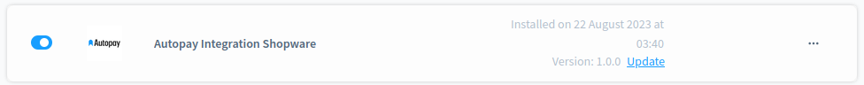
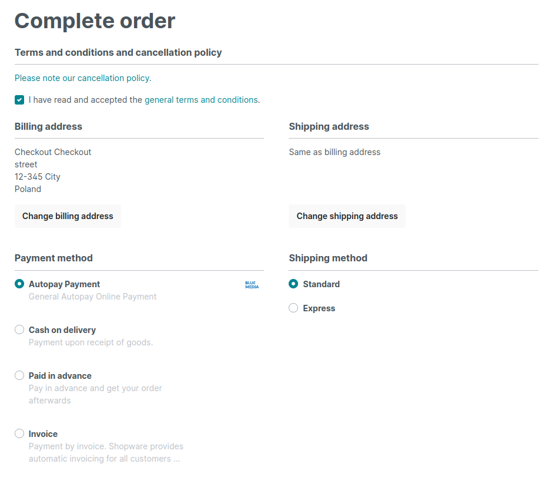

# Moduł BluePayment dla platformy Shopware 6

## Podstawowe informacje

BluePayment to moduł płatności umożliwiający realizację transakcji bezgotówkowych w sklepie opartym na platformie Shopware. Jeżeli jeszcze nie masz wtyczki, możesz ją pobrać [tutaj](https://store.shopware.com).

### Wymagania

- Sklep oparty na Shopware 6 (6.4.5.0 lub wyższa)
- Wersja PHP zgodna z wymaganiami danej wersji Shopware

### Dziennik zmian (changelog)

Dostępny [tutaj](./CHANGELOG_pl-PL.md).

## Instalacja

1. [Pobierz paczkę .zip](https://github.com/bluepayment-plugin/shopware/releases/download/1.0.0/BlueMediaShopwarePayment-1.0.0.zip).
2. Załóż konto w serwisie [PayBM](https://platnosci.bm.pl/) podając swoje dane firmowe. 
3. Zaloguj się do swojego panelu administracyjnego Shopware.
4. W panelu administracyjnym przejdź do `Extensions > My extensions` (`Rozszerzenia > Moje rozszerzenia`).

   
5. Naciśnij `Upload extension` (`Prześlij rozszerzenie`).

   
6. Wybierz pobraną paczkę .zip. Strona zostanie odświeżona automatycznie.
7. Paczka będzie widoczna na liście rozszerzeń.

   
8. Naciśnij `Install app` (`Zainstaluj aplikację`). Po zainstalowaniu strona zostanie odświeżona automatycznie.
9. Przejdź do aktywacji.

## Aktywacja

1. Naciśnij przełącznik po lewej stronie.

   
2. Po zainstalowaniu strona zostanie odświeżona automatycznie. Przejdź do konfiguracji.

### Aktualizacja

1. Pobierz paczkę .zip z nową wersją modułu z [Shopware Store](https://store.shopware.com/).
2. Zaloguj się do swojego panelu administracyjnego Shopware.
3. W panelu administracyjnym przejdź do `Extensions > My extensions` (`Rozszerzenia > Moje rozszerzenia`).
4. Naciśnij `Upload extension` (`Prześlij rozszerzenie`).
5. Wybierz pobraną paczkę .zip. Strona zostanie odświeżona automatycznie.
6. Paczka będzie widoczna na liście rozszerzeń.

   
7. Naciśnij `Update` (`Aktualizacja`). Po zainstalowaniu strona zostanie odświeżona automatycznie.
8. Przejdź do aktywacji.

## Konfiguracja

Aby umożliwić klientom sklepu korzystanie z płatności Blue Media, należy połączyć moduł ze środowiskiem Blue Media oraz podpiąć metodę płatności do danego kanału sprzedaży.

### Wtyczka Blue Media Payment

1. Wejdź w `Extensions > My extensions` (`Rozszerzenia > Moje rozszerzenia`).
2. Naciśnij 3 kropki `...` przy wtyczce Blue Media, a następnie `Configuration` (`konfiguracja`).

   

3. Wybierz kanał sprzedaży (Sales Channel), na którym chcesz aktywować integrację. Możesz także wybrać wszystkie kanały (`All Sales Channels`/`Wszystkie kanały sprzedaży`).
4. Wypełnij pola konfiguracyjne:
   - `Enable integration`/`Włącz integrację` (domyślnie: `disabled`/`wyłączone`) - włącza integrację z Blue Media na wybranym kanale sprzedaży
   - `Test mode`/`Tryb testowy` (domyślnie: `enabled`/`włączone`) - przełącznik między integracją produkcyjną a testową
   - `Blue Media Gateway address`/`Adres bramki Blue Media` (domyślnie: `https://pay.bm.pl/`) - produkcyjny adres URL bramki Blue Media
   - `Blue Media test gateway address`/`Adres bramki testowej Blue Media` (domyślnie: `https://pay-accept.bm.pl/`) - testowy adres URL bramki Blue Media (używany tylko, gdy `Test mode`/`Tryb testowy` jest włączony)
   - `Service ID`/`Identyfikator serwisu` - numeryczny identyfikator (otrzymasz go od Blue Media)
   - `Shared Key`/`Klucz konfiguracyjny (hash)` - unikalny klucz przypisany do danego sklepu (otrzymasz go od Blue Media)
   - `Hash function mechanism`/`Mechanizm funkcji skrótu` (domyślnie: `SHA256`) - metoda szyfrowania hash używana przez Blue Media (musi być taka sama jak po stronie Blue Media w panelu `Konfiguracja Hasha`)
   - `Verify Credentials Button`/`Zweryfikuj poświadczenia` - pozwala na weryfikację powyższej konfiguracji przed zapisem (ignoruje ustawienie `Enable integration`/`Włącz integrację`)

   - `Process Order Status on Transaction Capture`/`Przetwarzaj status zamówienia podczas przechwytywania transkacji` - po włączeniu status zamówienia w Shopware będzie zmieniany na `In progress`, gdy transakcja zostanie zatwierdzona przez Blue Media

### Metoda płatności

Metoda płatności Blue Media tworzona jest w momencie instalacji modułu. Aby aktywować metodę płatności w sklepie, należy przypisać ją w ustawieniach danego kanału sprzedaży. 

Metoda płatności Blue Media jest aktywowana i deaktywowana równolegle z całym modułem. Można ją jednak deaktywować również ręcznie w panelu administracyjnym (`Settings > Payment methods`).

Przed przystąpieniem do konfiguracji kanału sprzedaży upewnij się, że moduł i metoda płatności są aktywne.

1. Aby umożliwić klientom kanału sprzedaży korzystanie z płatności Blue Media, przejdź do ustawień kanału sprzedaży.

   
2. W polu `Payment methods` (`Metody płatności`) dodaj metodę płatności Blue Media Payment.

   
3. Zapisz zmiany naciskając przycisk `Save` (`Zapisz`) na górze ekranu.
4. Metoda płatności jest widoczna w checkoucie:

   

### Dodatkowe informacje

Podczas instalacji moduł:
- tworzy metodę płatności Blue Media (pay-by-link)
- tworzy walutę PLN, jeśli takowa nie istnieje w systemie
- tworzy regułę dla metody płatności (obsługa tylko waluty PLN)
