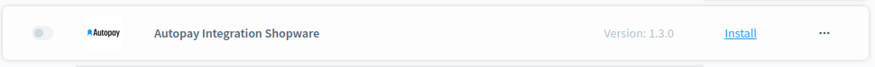
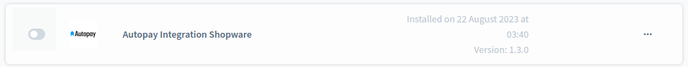
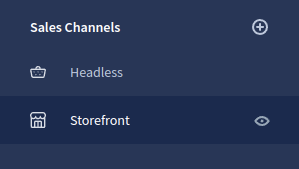
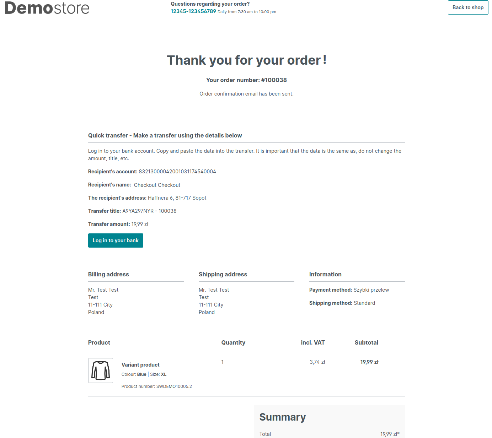

# Moduł Autopay dla platformy Shopware 6

## Podstawowe informacje

Autopay to moduł płatności umożliwiający realizację transakcji bezgotówkowych w sklepie opartym na platformie Shopware. Jeżeli jeszcze nie masz wtyczki, możesz ją pobrać [tutaj](https://github.com/bluepayment-plugin/shopware/releases).

### Wymagania

- Sklep oparty na Shopware 6 (od 6.4.5.0 do 6.4.20.2)
- Wersja PHP zgodna z wymaganiami danej wersji Shopware

### Dziennik zmian (changelog)

Dostępny [tutaj](./CHANGELOG_pl-PL.md).

## Instalacja

1. [Pobierz paczkę .zip](https://github.com/bluepayment-plugin/shopware/releases).
2. Załóż konto w serwisie [Autopay](https://autopay.eu/) podając swoje dane firmowe. 
3. Zaloguj się do swojego panelu administracyjnego Shopware.
4. W panelu administracyjnym przejdź do `Extensions > My extensions` (`Rozszerzenia > Moje rozszerzenia`).

   
5. Naciśnij `Upload extension` (`Prześlij rozszerzenie`).

   
6. Wybierz pobraną paczkę .zip. Strona zostanie odświeżona automatycznie.
7. Paczka będzie widoczna na liście rozszerzeń.

   
8. Naciśnij `Install app` (`Zainstaluj aplikację`). Po zainstalowaniu strona zostanie odświeżona automatycznie.
9. Przejdź do aktywacji.

## Aktywacja

1. Naciśnij przełącznik po lewej stronie.

   
2. Po zainstalowaniu strona zostanie odświeżona automatycznie. Przejdź do konfiguracji.

### Aktualizacja

1. [Pobierz paczkę .zip z nową wersją modułu](https://github.com/bluepayment-plugin/shopware/releases).
2. Zaloguj się do swojego panelu administracyjnego Shopware.
3. W panelu administracyjnym przejdź do `Extensions > My extensions` (`Rozszerzenia > Moje rozszerzenia`).
4. Naciśnij `Upload extension` (`Prześlij rozszerzenie`).
5. Wybierz pobraną paczkę .zip. Strona zostanie odświeżona automatycznie.
6. Paczka będzie widoczna na liście rozszerzeń.

   
7. Naciśnij `Update` (`Aktualizacja`). Po zainstalowaniu strona zostanie odświeżona automatycznie.
8. Przejdź do aktywacji.

## Konfiguracja

Aby umożliwić klientom sklepu korzystanie z płatności Autopay, należy połączyć moduł ze środowiskiem Autopay oraz podpiąć metodę płatności do danego kanału sprzedaży.

### Wtyczka Autopay Payment

1. Wejdź w `Extensions > My extensions` (`Rozszerzenia > Moje rozszerzenia`).
2. Naciśnij 3 kropki `...` przy wtyczce Autopay, a następnie `Configuration` (`konfiguracja`).

   

3. Wybierz kanał sprzedaży (Sales Channel), na którym chcesz aktywować integrację. Możesz także wybrać wszystkie kanały (`All Sales Channels`/`Wszystkie kanały sprzedaży`).
4. Wypełnij pola konfiguracyjne:
   - `Enable integration`/`Włącz integrację` (domyślnie: `disabled`/`wyłączone`) - włącza integrację z Autopay na wybranym kanale sprzedaży
   - `Test mode`/`Tryb testowy` (domyślnie: `enabled`/`włączone`) - przełącznik między integracją produkcyjną a testową
   - `Autopay Gateway address`/`Adres bramki Autopay` (domyślnie: `https://pay.autopay.eu/`) - produkcyjny adres URL bramki Autopay
   - `Autopay test gateway address`/`Adres bramki testowej Autopay` (domyślnie: `https://testpay.autopay.eu/`) - testowy adres URL bramki Autopay (używany tylko, gdy `Test mode`/`Tryb testowy` jest włączony)
   - `Service ID`/`Identyfikator serwisu` - numeryczny identyfikator (otrzymasz go od Autopay)
   - `Hash key`/`Klucz hash` - unikalny klucz przypisany do danego sklepu (otrzymasz go od Autopay)
   - `Hash encryption method`/`Metoda szyfrowania hash` (domyślnie: `SHA256`) - metoda szyfrowania hash używana przez Autopay (musi być taka sama jak po stronie Autopay w panelu `Konfiguracja Hasha`)
   - `Verify Credentials Button`/`Zweryfikuj poświadczenia` - pozwala na weryfikację powyższej konfiguracji przed zapisem (ignoruje ustawienie `Enable integration`/`Włącz integrację`)

   - `Process Order Status on Transaction Capture`/`Przetwarzaj status zamówienia podczas przechwytywania transkacji` - po włączeniu status zamówienia w Shopware będzie zmieniany na `In progress`, gdy transakcja zostanie zatwierdzona przez Autopay

### Metoda płatności

Metody płatności Autopay tworzone są w momencie instalacji modułu. Aby aktywować metodę płatności w sklepie, należy przypisać ją w ustawieniach danego kanału sprzedaży. 

Metoda płatności Autopay jest aktywowana i deaktywowana równolegle z całym modułem. Można ją jednak deaktywować również ręcznie w panelu administracyjnym (`Settings > Payment methods`).

Przed przystąpieniem do konfiguracji kanału sprzedaży upewnij się, że moduł i metoda płatności są aktywne.

1. Aby umożliwić klientom kanału sprzedaży korzystanie z płatności Autopay, przejdź do ustawień kanału sprzedaży.

   
2. W polu `Payment methods` (`Metody płatności`) dodaj metodę płatności Autopay Payment.

   
3. W polu Currencies dodaj walutę “Polish Zloty”. Tylko ta waluta jest obsługiwana przez wtyczkę.
4. Zapisz zmiany naciskając przycisk `Save` (`Zapisz`) na górze ekranu.
5. Metoda płatności jest widoczna w checkoucie:

   

### Zarządzanie dodatkowymi metodami płatności (Lista Bramek Płatności)

Poza przypisaniem metody płatności do kanału sprzedaży należy również aktywować odpowiednią bramkę płatności Autopay

1. W menu wybierz `Orders -> Autopay Gateways` / `Zamówienia -> Bramki Autopay`

2. Lista synchronizuje się automatycznie ale można wymusić synchronizację na życzenie przyciskiem `Synchronize gateways`.
3. Po wybraniu i przejściu do edycji poszczególnej bramki płatności możliwe jest włączenie obsługi danej branki w ramach wybranego kanału sprzedzaży.
4. Wszystkie włączone i wspierane bramki płatności będą widoczne w koszyku bramki które nie będą dostępne lub nie zostaną włączone zostaną ukryte.

### Szczegółowe metody płatności

1. Szczególowa metoda płatności Autopay z opcją wyboru bramki płatności pozwala na wybór z pogrupowanej listy wyboru odpowiedniej bramki płatności jeszcze przed przekierowaniem do dostawcy płatności:

2. W przypadku specyficznych metod płatności (White Label) np. Szybki przelew, do wyboru będa dostępne tylko bramki z wybranej grupy:
   

3. Metody Szybki przelew, Pay by Link itp. (niesygnowane ikoną Autopay) integrują się ze sklepem i posiadają własną implementację zachowania:

- Szybki przelew podaje dane do przelewu na stronie podsumowania zamówienia:

- Pay by link - przekierowuje bezpośrednio na stronę banku, z pominięciem Autopay. 

- Google Pay - możliwa jest płatność kartą z wykorzystaniem Google Pay
    - podczas składania zamówienia dodatkowo pojawi się popup pozwalający na wybór jednej z kart płatniczych GooglePay
    - następnie zamówienie zostanie złożone a token karty zostanie przekazany do Autopay w celu autoryzacji płatności
### Dodatkowe informacje

Podczas instalacji moduł:
- tworzy metodę płatności Autopay (general - redirect do Autopay)
- tworzy dodatkowe metody płatności:
  - Szczególową metodę płatności - umożliwiająca zarządzanie poszczególnymi bramkami płatności,
  - Metody specyficzne (white-label):
    - Płatność Linkiem
    - Szybki przelew
    - Apple Pay
    - Google Pay
    - BLIK
- tworzy walutę PLN, jeśli takowa nie istnieje w systemie
- tworzy reguły dla stworzonych metod płatności (obsługa tylko waluty PLN)
